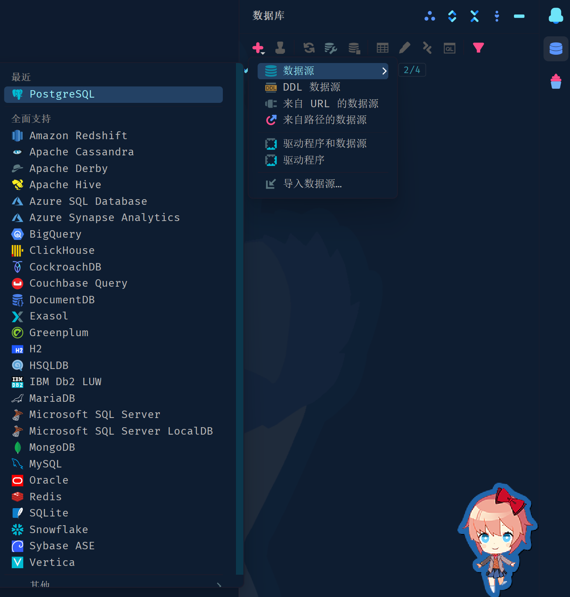
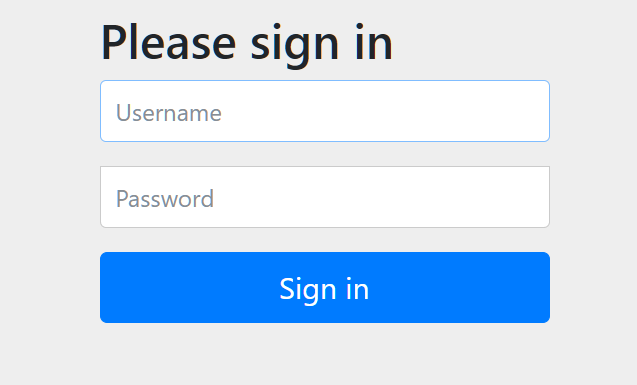

# library-management-system

这是一个图书管理系统。  
也是一个探索使用ddd数据对象传递的项目。  
在这里会详细描述ddd的分层目录。  
也会详细的描述系统的流程 : 包括创建、集成、业务等流程。  
以及可能出现的错误，并给出解决方案。

## 创建流程

在 https://start.spring.io/ 中填写信息  
例如：项目名称、版本号、需要的依赖

然后点击 **GENERATE** _下载_ _解压_   
之后 _右键_ 选择 _Open Folder as IntelliJ IDEA Project_  
可能有些人在初始化gradle时会遇到错误 :

```html
Could not initialize class
org.gradle.internal.classloader.FilteringClassLoader
```

查了网上的信息说是 :

```html
这个错误信息表明在初始化
org.gradle.internal.classloader.FilteringClassLoader类时出现了问题。
这个问题可能是由于Gradle的运行环境（例如JDK版本）不兼容或者Gradle版本冲突造成的。
您可以尝试检查您的Gradle和JDK版本是否兼容，或者尝试更新Gradle版本来解决这个问题。
```

事实上是因为相关idea的路径上有中文。修改之后就好了。

## 技术分析

使用的技术包括：  
spring boot 3、 spring security 6、 spring data jpa、Gradle、  
spring data redis、 lombok、springdoc、数据库（PostgreSQL）

## 集成流程

### 集成springdoc

1. 创建一个接口
   创建一个interfaces包，在包中创建一个DemoCtrl类。

```java

@RestController
@RequestMapping("api/v1")
public class DemoCtrl {

	@GetMapping("say")
	public ResponseEntity<String> sayHello() {
		return ResponseEntity.ok("hello");
	}
}
```

将springdoc依赖添加到[build.gradle](build.gradle)中。

```groovy
implementation group: 'org.springdoc', name: 'springdoc-openapi-starter-webmvc-ui', version: '2.1.0'
```

2. 添加数据库

可以在idea中添加数据源

在这里选择需要的数据库

填写用户名和密码，PostgreSQL的默认用户名为**postgres**  
下面的选择的url就是填写在application.yml中的url  
在application.yml中添加

```yaml
spring:
  datasource:
    url: jdbc:postgresql://localhost:5432/demofromddd
    username: postgres
    password: xiaoyi_wyx
    driver-class-name: org.postgresql.Driver
```

然后就可以启动服务器了，在浏览器中打开
http://localhost:8080/swagger-ui/index,html
  
这是spring security的basic login，默认用户 : user  
密码 : 
登录之后就可以看到swagger页面了。


### 集成jpa
